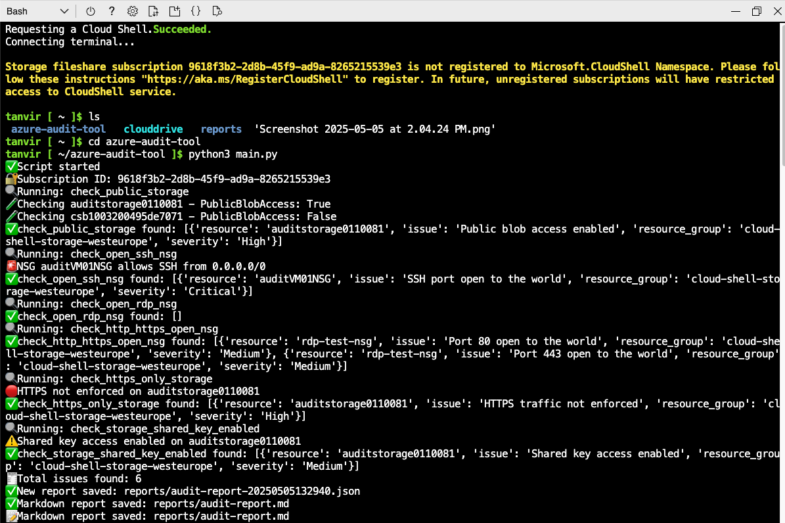
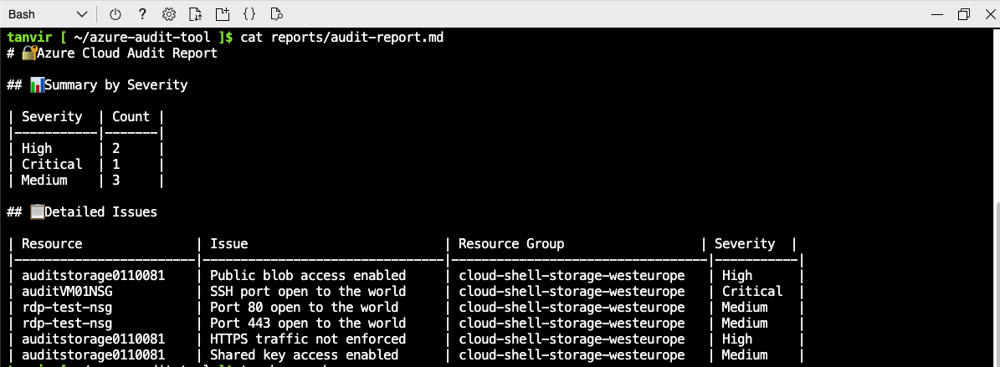
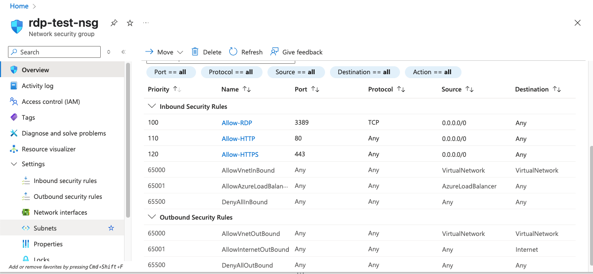
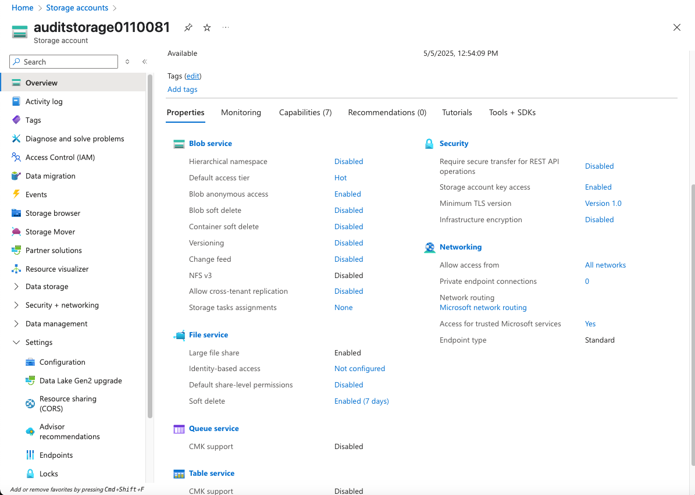

# Azure Audit Tool ✨

A lightweight and modular Python-based auditing tool that scans your Azure subscription for common misconfigurations. Designed for educational use, cybersecurity portfolios, and Erasmus Mundus cybersecurity applications.

---

## 🔧 Features

- ✅ Scans Azure storage and NSG settings
- ✅ Detects critical security misconfigurations:
  - Public blob access
  - SSH/RDP open to world
  - HTTP/HTTPS exposure
  - Shared Key access enabled
  - HTTPS not enforced
- ✅ Exports:
  - JSON reports
  - Professional Markdown tables
- ✅ Modular, extensible architecture (each check is its own function)

---

## 🛁 Project Structure

```
azure-audit-tool/
├── main.py
├── run.sh
├── requirements.txt
├── .gitignore
├── README.md
├── reports/
│   ├── audit-report.md
│   └── audit-report-YYYY-MM-DD_HH-MM-SS.json
├── screenshots/
│   ├── scan-summary.png
│   ├── markdown-report.png
│   ├── nsg-rdp-ssh.png
│   └── storage-settings.png
└── modules/
    ├── __init__.py
    ├── auth.py
    ├── misconfig_checks.py
    ├── report_generator.py
    └── markdown_report.py
```

---

## 📃 Report Example

```
## 📊 Summary by Severity

| Severity | Count |
|----------|--------|
| High     | 2      |
| Medium   | 3      |
| Critical | 1      |

## 📄 Detailed Issues

| Resource              | Issue                       | Resource Group                  | Severity |
|-----------------------|-----------------------------|----------------------------------|----------|
| auditstorage0110081   | Public blob access enabled  | cloud-shell-storage-westeurope  | High     |
| auditVM01NSG          | SSH port open to the world  | cloud-shell-storage-westeurope  | Critical |
| rdp-test-nsg          | Port 80 open to the world   | cloud-shell-storage-westeurope  | Medium   |
| rdp-test-nsg          | Port 443 open to the world  | cloud-shell-storage-westeurope  | Medium   |
| auditstorage0110081   | HTTPS traffic not enforced  | cloud-shell-storage-westeurope  | High     |
| auditstorage0110081   | Shared key access enabled   | cloud-shell-storage-westeurope  | Medium   |
```

---

## 🚀 Quick Start

### 1. Clone Repository
```bash
git clone https://github.com/tanviiiiir-r/azure-audit-tool.git
cd azure-audit-tool
```

### 2. Install Requirements
```bash
pip install -r requirements.txt
```

### 3. Run the Audit
```bash
python3 main.py
```

---

## 🔎 Detected Misconfigurations
| Check                            | Description                                  | Severity |
|----------------------------------|----------------------------------------------|----------|
| Public Blob Access               | Container allows anonymous access            | High     |
| SSH Port 22 Open                 | NSG allows 0.0.0.0/0 on port 22              | Critical |
| RDP Port 3389 Open               | NSG allows 0.0.0.0/0 on port 3389            | Medium   |
| HTTP/HTTPS Ports Open (80/443)  | NSG allows 0.0.0.0/0 on ports 80 or 443      | Medium   |
| HTTPS Not Enforced              | Storage account allows HTTP connections      | High     |
| Shared Key Access Enabled        | Insecure access to storage account enabled   | Medium   |

---

## 🌍 Screenshots

### 🔹 Terminal Scan Summary


### 🔹 Markdown Report Output


### 🔹 Azure NSG Misconfigurations (RDP/HTTP/HTTPS)


### 🔹 Azure Storage Account Settings


---

## 🔍 Tech Stack
- Azure Python SDK
- Markdown Table Generator
- JSON Report Generator

---

## ✏️ License
MIT License. Feel free to fork and modify!

---

## 🌟 Credits
Created by [tanviiiiir-r](https://github.com/tanviiiiir-r) 

---
